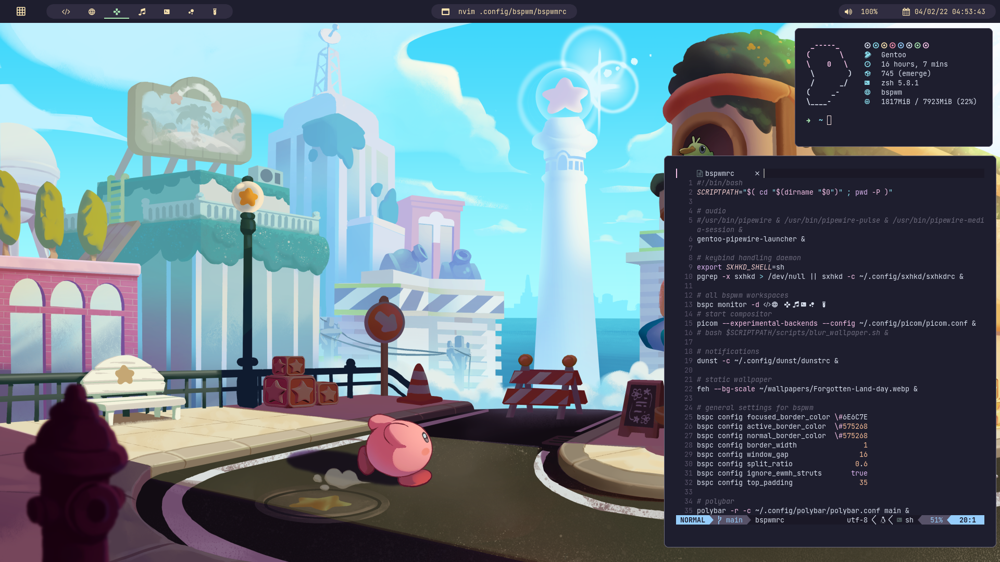

<div align="center">
    <h1>🌸 azalea</h1>
</div>



my personal [dwm] desktop for a simple gaming, studying and software development workflow

- 🔊 [pipewire] is being used as audio server
- 🎨 [zenbones] is being used as color scheme
- 🖥️ [st] is being used as terminalemulator
- 📜 [neovim] is being used as text editor
- 💥 [picom] is being used as x.org compositor
- 📊 [polybar-dwm-module] is being used as status bar

[dwm]: https://code.syntax.lol/dwm
[st]: https://code.syntax.lol/st
[zenbones]: https://github.com/mcchrish/zenbones.nvim
[pipewire]: https://gitlab.freedesktop.org/pipewire/pipewire/
[neovim]: https://github.com/neovim/neovim
[picom]: https://github.com/dccsilag/picom
[polybar-dwm-module]: https://github.com/mihirlad55/polybar-dwm-module

## installation process


**1. installing xorg**

```bash
# This assumes you have the 'yay' AUR helper installed on your machine.
yay -S xorg-server xorg-xinit xorg-xrdb
```

**2. installing the window manager**

```bash
mkdir /tmp/dwm-pkgbuild &&
    cd /tmp/dwm-pkgbuild &&
    wget https://raw.githubusercontent.com/FromSyntax/dwm/main/PKGBUILD &&
    makepkg -si
```

**5. installing the audio server**

```bash
yay -S pipewire pipewire-pulse pipewire-alsa wireplumber
```

**5. installing the status bar and notifications**

```bash
yay -S pamixer playerctl dunst xorg-xsetroot python-dbus polybar-dwm-module
```

**6. installing the terminal emulator**

```bash
mkdir /tmp/st-pkgbuild &&
    cd /tmp/st-pkgbuild &&
    wget https://raw.githubusercontent.com/FromSyntax/st/main/PKGBUILD &&
    makepkg -si
```

**7. installing the x.org compositor**

```bash
yay -S picom-animations-git
```

**8. symlinking configuration files**

⚠️ make sure that you moved your azalea directory to a place you wouldn't delete by accident before
running this.

```bash
./scripts/symlink.sh
./scripts/bin.sh
```

**9. installing neovim**

```bash
yay -S neovim
dots neovim install # if you used bin.sh, it will be available as /usr/bin/dots
```

And that's it! You can now enjoy azalea just by using the `startx` command on TTY or using any display
manager.
