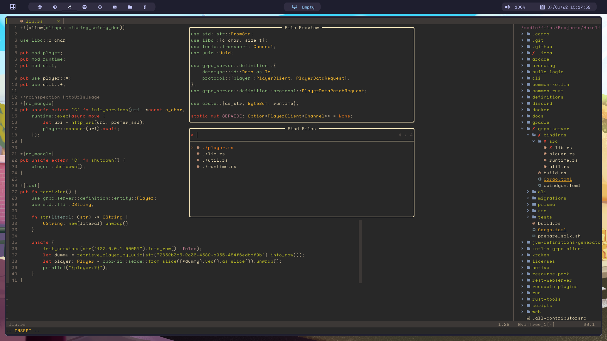

    <h1>🌌 azalea.nvim</h1>

my personal neovim dotfiles optimized for a productive web and game development workflow

**🔁 ft.** [packer.nvim], [nvim-tree.lua], [alpha.nvim], [barbar.nvim], [lualine.nvim],
[nvim-web-devicons], [colorizer.nvim], [telescope.nvim], [nvim-cmp], [nvim-notify], 
[fidget.nvim], [nvim-treesitter], [nvim-lspconfig], [vim-surround], [auto-pairs],
[which-key.nvim], [Comment.nvim], [lsp-colors.nvim], [lsp-status.nvim], [lspkind-nvim],
[dressing.nvim], [wilder.nvim]

**🎨 themes.** catppuccin, gruvbox

## language server dependencies 文字

everything here is optional except by fzy (unless you don't want telescope stuff to work)

* [`fzy`] - faster alternative to fzf
* [`npm`] (optional) - nodejs package manager; allows copilot to work
* [`doas npm i -g tsserver`][npm] - typescript and javascript language server
* [`doas npm i -g vls`][npm] - vue.js language server
* [`doas npm i -g vscode-langservers-extracted`][npm] - html, eslint, json, css language servers
* [`rust-analyzer`] - rust language server
* [`clangd`] - c and c++ language server
* [`jdtls`] **wip** - java language server

[`fzy`]: https://github.com/jhawthorn/fzy
[`npm`]: https://nodejs.org
[`rust-analyzer`]: https://rust-analyzer.github.io/manual.html
[`clangd`]: https://clangd.llvm.org/
[`jdtls`]: https://github.com/eclipse/eclipse.jdt.ls 

[packer.nvim]: https://github.com/wbthomason/packer.nvim
[nvim-tree.lua]: https://github.com/kyazdani42/nvim-tree.lua
[alpha.nvim]: https://github.com/goolord/alpha-nvim
[barbar.nvim]: https://github.com/romgrk/barbar.nvim
[lualine.nvim]: https://github.com/nvim-lualine/lualine.nvim
[nvim-web-devicons]: https://github.com/kyazdani42/nvim-web-devicons
[colorizer.nvim]: https://github.com/norcalli/nvim-colorizer.lua
[dressing.nvim]: https://github.com/stevearc/dressing.nvim
[wilder.nvim]: https://github.com/gelguy/wilder.nvim
[telescope.nvim]: https://github.com/nvim-telescope/telescope.nvim
[nvim-cmp]: https://github.com/hrsh7th/nvim-cmp
[nvim-notify]: https://github.com/rcarriga/nvim-notify
[fidget.nvim]: https://github.com/j-hui/fidget.nvim
[nvim-treesitter]: https://github.com/nvim-treesitter/nvim-treesitter
[nvim-lspconfig]: https://github.com/neovim/nvim-lspconfig
[vim-surround]: https://github.com/tpope/vim-surround
[auto-pairs]: https://github.com/jiangmiao/auto-pairs
[which-key.nvim]: https://github.com/folke/which-key.nvim
[Comment.nvim]: https://github.com/numToStr/Comment.nvim
[lsp-colors.nvim]: https://github.com/folke/lsp-colors.nvim
[lsp-status.nvim]: https://github.com/nvim-lua/lsp-status.nvim
[lspkind-nvim]: onsails/lspkind-nvim
